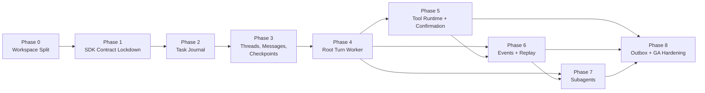
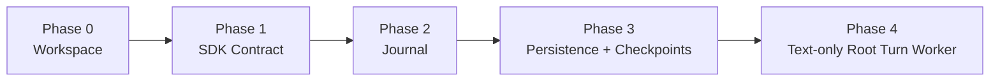
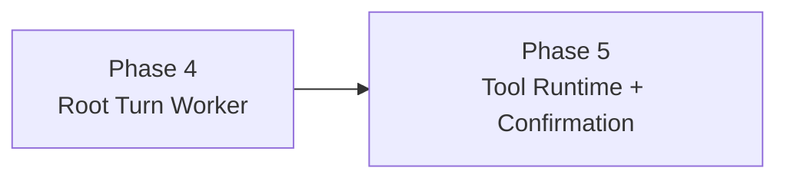
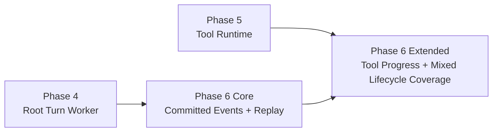
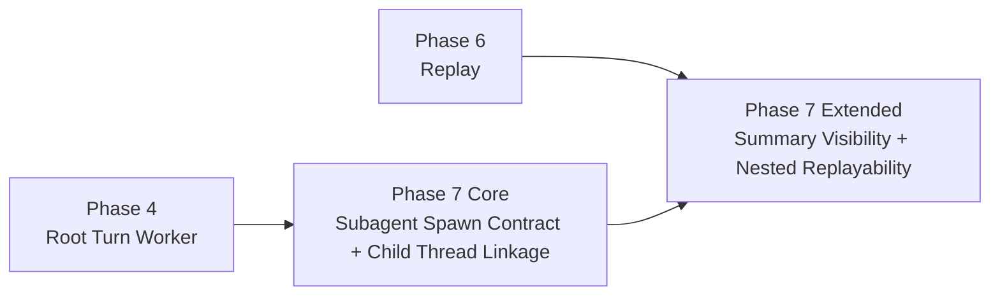
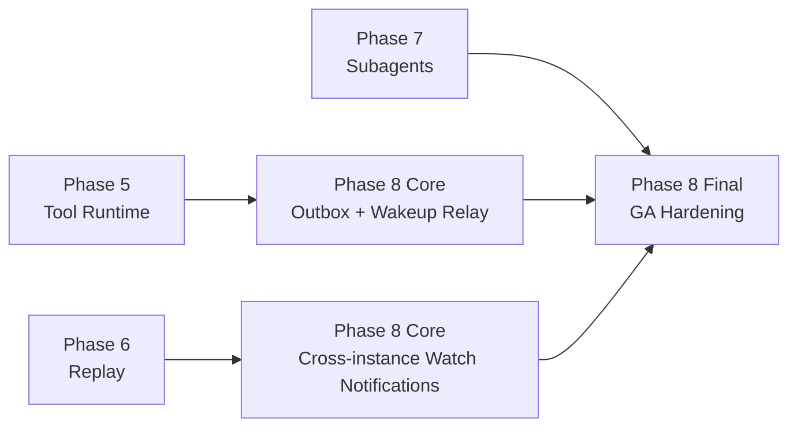
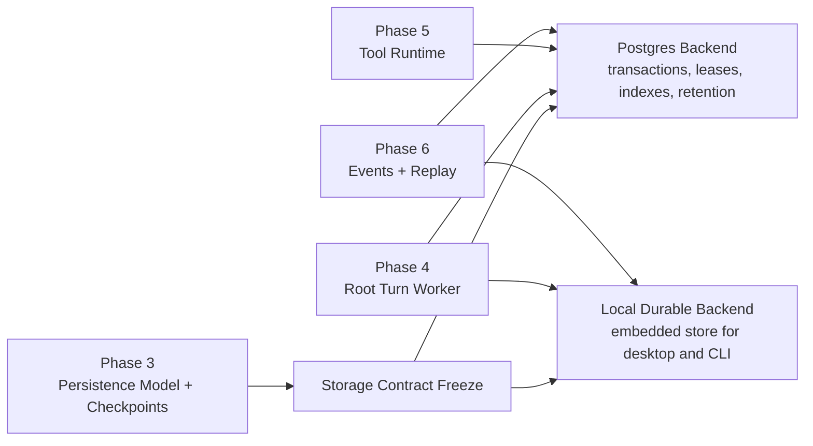
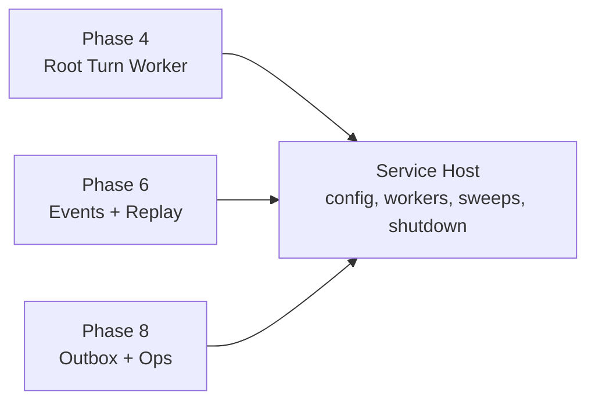
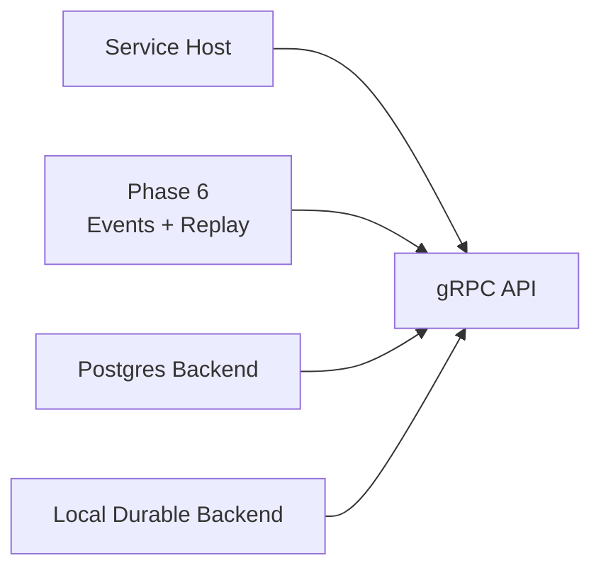

# Agent Server Dependency And Delivery Map

This document explains what depends on what, why those dependencies exist, and how to increase system complexity incrementally without collapsing many hard problems into one implementation step.

## 1. Current Parent-Phase Dependency Graph

This graph is directionally correct, but it is not sufficient on its own. It does not distinguish the minimal end-to-end path from late-stage completeness work.

It also does not yet show the new delivery tracks required by real deployment: concrete storage backends, a reference service host, and gRPC transport.

## 2. Minimal Durable Path

If the goal is to validate the core model with the least simultaneous complexity, the critical path is:

This path proves the foundational claims:

- the SDK can be server-driven
- tasks are the execution authority
- recovery works from completed-turn checkpoints
- root turns can execute without inline tool work

Until this path is validated, later branches should remain scoped as downstream complexity, not parallel bets.

## 3. Complexity Branches After Phase 4

### Branch A: Tool mutation safety

This branch adds:

- child `tool_runtime` tasks
- durable execution intent
- confirmation pause or resume
- operation identity
- parent resume from child outcomes

This is the first branch that introduces production-side effects.

### Branch B: Durable observation

This is the recommended refinement, even if Linear still tracks Phase 6 as one parent issue. The reason is simple: root-turn event durability can be proven before the system has all tool-runtime complexity online.

### Branch C: Durable multi-agent hierarchy

Subagent execution should reuse the worker and checkpoint model, but the replay and visibility story is cleaner once Phase 6 is proven.

### Branch D: Latency layer and GA operations

The current parent dependency on Phases 5, 6, and 7 is still correct for final Phase 8 completion, but not every operational piece needs to wait for the entire subagent surface.

## 4. Additional Delivery Tracks Required By Actual Deployment

The current runtime ladder is still the backbone, but it is no longer the whole plan. The repo and deployment requirements now force three additional tracks.

### Track A: concrete durability backends

This track exists because the current repo only has in-memory reference stores. We cannot validate multi-process durability claims without a real backend.

### Track B: service-host packaging

This track keeps the runtime embeddable while giving the project a real daemon or service process shape for Kubernetes and desktop use.

### Track C: gRPC transport

The desktop app requirement makes gRPC a first-class deliverable. The stream model should sit on committed event envelopes, not on in-memory runtime channels.

## 5. What Each Phase Must Prove Before Unlocking The Next

| Phase | Must Prove | Enables |
| --- | --- | --- |
| 0 | workspace split and crate graph can carry the rewrite | phase-safe SDK and server iteration |
| 1 | direct `run_turn`, event barrier, continuation, tool handoff, audit surfaces | server workers and journal integration |
| 2 | journal ownership, leases, retries, waiting states, child-task model | any real worker execution |
| 3 | atomic completed-turn commit and checkpoint recovery | crash-safe root turn worker |
| 4 | one root turn can run, suspend, and commit safely | tool runtime, durable replay, durable subagents |
| 5 | tool work can execute and resume safely as child tasks | mutation-safe agent behavior |
| 6 | committed event replay is authoritative | reconnect correctness, cross-instance watch |
| 7 | child threads and descendant trees behave durably | stable multi-agent server claims |
| 8 | transport latency layer and ops hardening do not weaken correctness | production deployment readiness |

## 6. Recommended Milestone Shape

Milestones should represent implementation-complete exits, not design signoff. Recommended milestone sequence:

1. `M0 Workspace Ready`
2. `M1 SDK Boundary Locked`
3. `M2 Journal Owns Execution`
4. `M3 Completed-Turn Persistence`
5. `M4 Root Turn Worker Running`
6. `M5 Tool Runtime Safe For Mutation`
7. `M6 Durable Replay And Live Tail`
8. `M7 Durable Subagent Trees`
9. `M8 Outbox Relay And GA Hardening`

If the team wants more granular review checkpoints, those should live in phase parents or design docs, not replace the implementation milestones.

## 7. Delivery View By Deployment Target

The same runtime should be able to land in three environments without changing the authority model.

### Remote internal service

- runtime phases 0 to 8
- PostgreSQL backend
- service host
- transport as needed for callers

### App-facing server integration

- runtime phases 0 to 8
- PostgreSQL backend
- Artemis or equivalent only as wakeup and worker dispatch
- embedded or sidecar service-host shape depending app architecture

### Local desktop or CLI agent

- runtime phases 0 to 8, though some later slices may be staged
- local durable backend
- local daemon or embedded host
- gRPC API for desktop communication

## 8. Missing Cross-Cutting Artifacts

These are not new implementation phases, but they are needed to keep complexity under control:

- invariant catalog
- scenario matrix for success and failure flows
- overview doc for new contributors
- architecture atlas or interactive visualization
- milestone-to-issue mapping
- storage ADR for local durability
- PostgreSQL transactional and migration spec
- gRPC contract and stream semantics doc
- service-host lifecycle doc

## 9. Current Planning And Implementation Gaps

- Phase 4 is partially implemented in code and partially active in Linear.
- Phase 5 still lacks a detailed child-issue breakdown in Linear.
- The repo still has no concrete PostgreSQL backend.
- The repo still has no local durable backend.
- The repo still has no service-host crate or binary target.
- The repo still has no gRPC surface.

## 10. Recommended Next Planning Cleanup

1. Realign the project milestones with the current replacement phases.
2. Attach every phase parent to its milestone.
3. Add explicit planning and issue coverage for PostgreSQL, local durability, service-host packaging, and gRPC.
4. Decide whether those tracks live as post-Phase-3 enabling work or as cross-cutting slices attached to Phases 4, 6, and 8.
5. Add a simple “phase exit” section to each phase parent issue so the team knows what proof unlocks the next branch.
